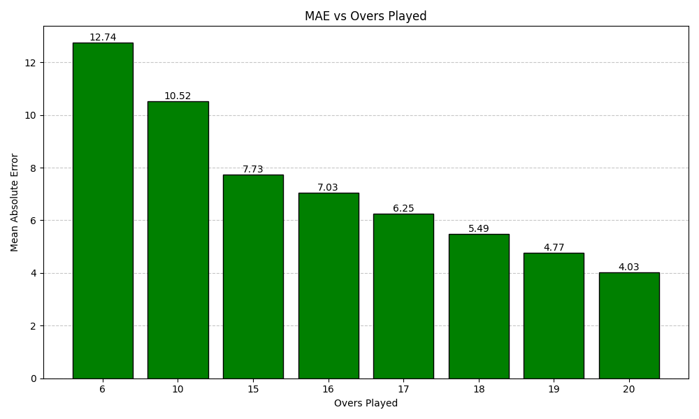

# Final Score Predictor (T20 Cricket)

A beginner-friendly machine learning project that predicts the **final first-innings total** in a T20 match.

This repository includes:
- A trained and trainable **XGBoost** model
- An interactive **CLI predictor** with venue and player selection
- Support for saving/loading batting and bowling lineups from text files
- Training plots saved to the `output/` directory

## 1. What This Project Does

Given current match state inputs such as:
- runs scored
- wickets lost
- overs completed
- momentum (runs in last 3 overs)

and team context such as:
- venue conditions
- selected batter lineup
- selected bowler lineup

it predicts the expected final score for the first innings.

---

## 2. Project Structure

```text
Final-score-predictor/
├─ dataset/                     # Input datasets (CSV)
├─ input/                       # Saved lineup text files
├─ output/                      # Generated plots
├─ Xgboost/
│  ├─ train_v5.ipynb            # Training notebook
│  └─ cricket_team_model_v5.json# Trained model file
├─ predict_v5_cli.py            # Interactive prediction CLI
└─ requirements.txt             # Python dependencies
```

---

## 3. Prerequisites

Install these first:
- Python 3.10+ (3.11 or 3.12 is also fine)
- pip

Optional but recommended:
- A virtual environment (`venv`)

---

## 4. Setup (Step by Step)

### Step 1: Open terminal in project folder

```bash
cd /path/to/Final-score-predictor
```

### Step 2: Create virtual environment

Linux/macOS:
```bash
python3 -m venv .venv
source .venv/bin/activate
```

Windows (PowerShell):
```powershell
python -m venv .venv
.venv\Scripts\Activate.ps1
```

### Step 3: Install dependencies

```bash
pip install -r requirements.txt
```

Dependencies used:
- pandas
- numpy
- matplotlib
- seaborn
- scikit-learn
- xgboost
- questionary
- rich

---

## 5. Train the Model (Notebook Workflow)

Open and run the notebook:

```bash
jupyter notebook Xgboost/train_v5.ipynb
```

If you use VS Code, open `Xgboost/train_v5.ipynb` and run cells top-to-bottom.

What this does:
1. Loads dataset files from `dataset/`
2. Builds team-aware features (`team_sr`, `team_avg`, `team_eco`, etc.)
3. Trains XGBoost regressor
4. Saves model to:
   - `Xgboost/cricket_team_model_v5.json`
5. Saves plots to:
   - `output/mae_overs_played.png`
   - `output/match_count_mae_range/*.png`

---

## 6. Run the Predictor CLI

```bash
python3 predict_v5_cli.py
```

The CLI will guide you through:
1. Venue selection (search/autocomplete)
2. Batter team and lineup input
3. Bowler team and lineup input
4. Match state input (runs, wickets, overs, momentum)
5. Final score prediction

After each prediction, the CLI gives options to:
- Run another prediction
- Exit

---

## 7. How Playing XI Input Works

For both batter and bowler lineups, you can choose:
1. **Search and select players** interactively
2. **Load from TXT file** in `input/`

### Player count rules
- Minimum players: **5**
- Maximum players: **11**

### Auto-save behavior
When you select players interactively, the lineup is saved automatically to:
- `input/input_batter_<team>.txt`
- `input/input_bowler_<team>.txt`

Example:
- `input/input_batter_india.txt`
- `input/input_bowler_new_zealand.txt`

---

## 8. Lineup TXT File Format

You can create your own lineup files manually.

Example:

```text
role: batter
team: India
players:
Rohit Sharma
Shubman Gill
Virat Kohli
Suryakumar Yadav
Hardik Pandya
Ravindra Jadeja
Rishabh Pant
Axar Patel
Kuldeep Yadav
Jasprit Bumrah
Mohammed Siraj
```

Notes:
- One player per line under `players:` is easiest.
- Comma-separated or `|` separated values are also supported.
- Duplicate names are automatically removed.

---

## 9. Training Notebook

Notebook available at:
- `Xgboost/train_v5.ipynb`

It is useful for experimentation and visual checks.

Current path behavior in notebook:
- Model file -> `Xgboost/cricket_team_model_v5.json`
- Plots -> `output/` and `output/match_count_mae_range/`

---

## 10. Demo Run (Example)

Use this as a sample beginner flow.

### Step A: Train once

```bash
jupyter notebook Xgboost/train_v5.ipynb
```

Then run all cells in order.

Expected output includes lines like:

```text
TRAINING SUMMARY
Final Model Test MAE : 10.29 runs
SUCCESS: Model saved as cricket_team_model_v5.json
SUCCESS: Overs-played plot saved as mae_overs_played.png
```

### Step B: Start prediction

```bash
python3 predict_v5_cli.py
```

Then provide inputs in this order:
1. Select venue (autocomplete)
2. Select batter lineup (search or load TXT)
3. Select bowler lineup (search or load TXT)
4. Enter current runs
5. Enter wickets lost
6. Enter overs completed
7. Enter runs in last 3 overs

Example match-state input:
- Runs: `90`
- Wickets: `1`
- Overs: `10.2`
- Momentum: `28`

You will get a prediction panel and can choose:
- Run another prediction
- Exit

---

## 11. Plot Preview

Generated plot files are saved in `output/`.

### MAE vs Overs Played



---

## 12. Common Errors and Fixes

### Error: `ModuleNotFoundError: No module named 'xgboost'`
Cause:
- Dependencies not installed in the active Python environment.

Fix:
```bash
pip install -r requirements.txt
```

### Error: Model not found in predictor
Cause:
- You have not trained yet, or model file is missing.

Fix:
```bash
jupyter notebook Xgboost/train_v5.ipynb
```

### Error: dataset file not found
Cause:
- Wrong working directory or missing CSV files.

Fix:
- Run commands from project root.
- Verify required files exist in `dataset/`.

### Invalid overs input
Use T20 over-ball format like:
- `10.2` means 10 overs + 2 balls
- valid balls are 0 to 5 only

---

## 13. Beginner Workflow (Quick Start)

Use this exact order:

1. `pip install -r requirements.txt`
2. `jupyter notebook Xgboost/train_v5.ipynb` (then run all cells)
3. `python3 predict_v5_cli.py`

That is enough to train and start predicting.

---

## 14. Future Improvements (Optional)

Good next steps if you want to improve project quality:
- Add unit tests for feature engineering
- Add input validation for overs (ball part 0-5)
- Add model evaluation report export (CSV)
- Add versioned model naming with timestamps
- Add support for second-innings chase prediction

---

## 15. License / Academic Use

If this is for course/project submission, add your own license and attribution rules as required by your department.
